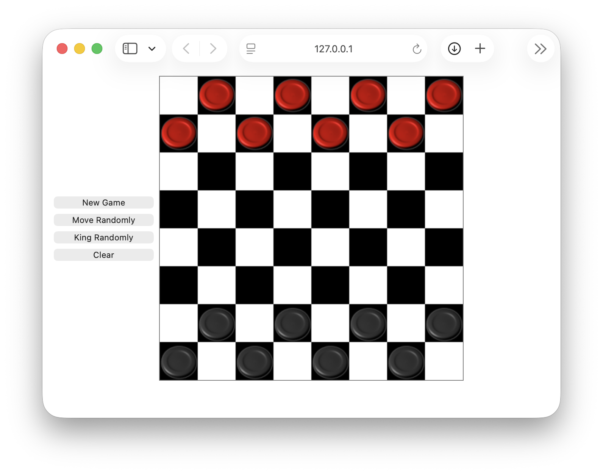

# Checkerboard Game

An interactive browser-based implementation of the classic game of checkers built with HTML, CSS, and JavaScript.

This project was developed as part of a User Interface Engineering course and focuses on creating an engaging game experience through interactive design, game logic, and dynamic user interactions.

## Preview

<p align="center">
  
</p>

---

## Overview

The Checkerboard Game recreates the traditional game of checkers in a web browser. Players can move pieces across the board, capture opposing pieces, and promote pieces to kings according to standard game rules.

The project emphasizes front-end development, game state management, event handling, and user interaction design while demonstrating the implementation of game mechanics using JavaScript.

---

## Built With

- HTML5
- CSS3
- JavaScript

---

## Features

- Interactive checkerboard interface
- Piece movement validation
- Turn-based gameplay
- Piece capture mechanics
- King promotion functionality
- Dynamic board updates
- Visual game state representation
- Browser-based gameplay
- Responsive user interface

---

## Skills Demonstrated

- JavaScript Programming
- Front-End Development
- Event Handling
- DOM Manipulation
- Game Logic Implementation
- State Management
- User Interface Design
- Problem Solving
- Object-Oriented Programming Concepts
- Software Development Fundamentals

---

## Project Structure

```text
checkerboard-game/
├── index.html
├── mainLayout.css
├── board.js
├── boardEvent.js
├── checker.js
├── images/
│   ├── black-piece.png
│   ├── red-piece.png
│   ├── black-king.png
│   └── red-king.png
├── screenshots/
├── README.md
├── LICENSE
└── .gitignore
```

## Game Mechanics

The application implements several core checkers mechanics including:

- Legal move validation
- Piece movement
- Turn management
- Opponent piece capture
- King promotion
- Board state tracking
- User interaction handling

---

## Learning Outcomes

Through this project, I gained experience with:

- Designing interactive web applications
- Managing complex application state
- Implementing game rules and logic
- Working with event-driven programming
- Manipulating the DOM dynamically
- Structuring JavaScript applications
- Debugging interactive systems
- Creating engaging user experiences

---

## How to Run

1. Clone the repository.

```bash
git clone https://github.com/Zaanie10/checkerboard-game.git
```

2. Navigate to the project directory.

```bash
cd checkerboard-game
```

3. Open `index.html` in your preferred web browser.

No installation or additional dependencies are required.

---

## Future Improvements

- Add score tracking
- Add move history
- Add multiplayer support
- Add AI opponent functionality
- Improve mobile responsiveness
- Add game restart functionality
- Implement additional game statistics
- Enhance animations and visual feedback

---

## Course Information

**Course:** CS 4712 – User Interface Engineering  
**Institution:** Kennesaw State University

---

## Author

**Zaanie Bowen**

- Portfolio: https://zaaniebowen.dev
- GitHub: https://github.com/Zaanie10
- LinkedIn: https://www.linkedin.com/in/melezaan-bowen-1bb690200/

---

*This project was completed as part of my Software Engineering coursework and demonstrates front-end development, event-driven programming, state management, and interactive application design.*
